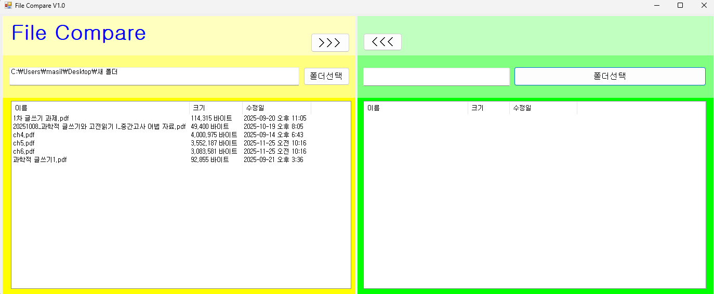
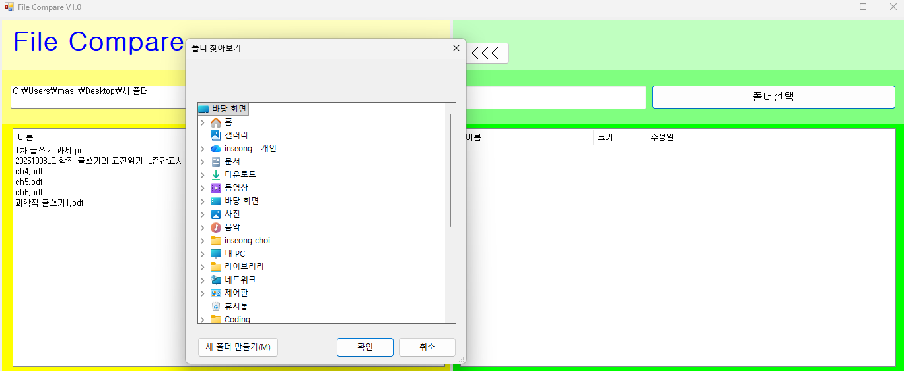
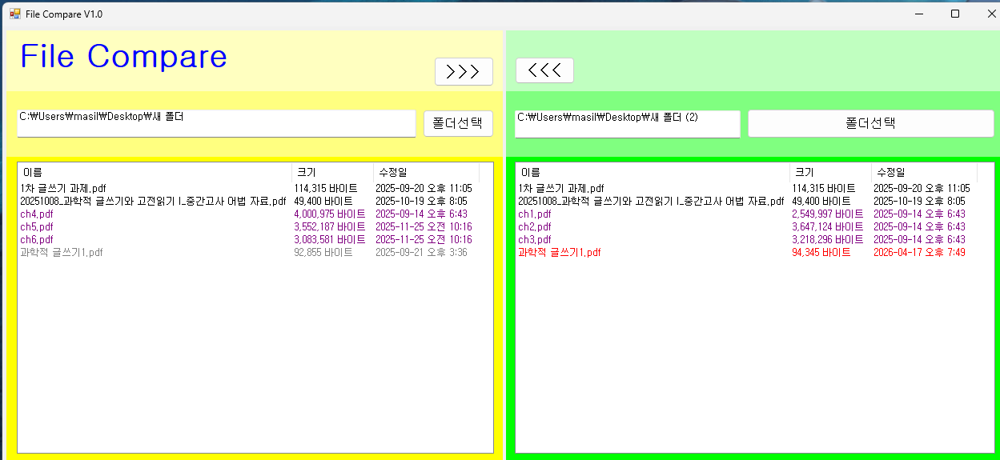
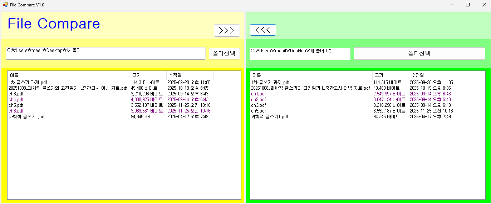
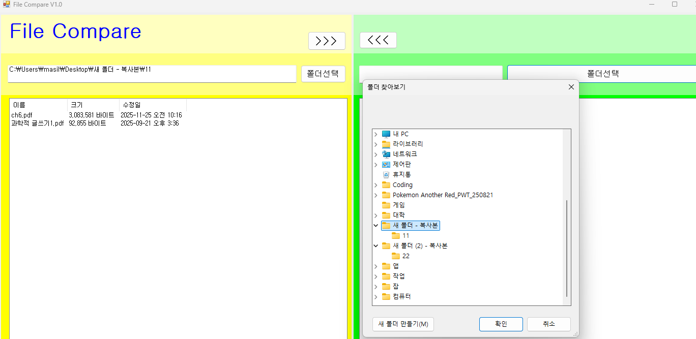

# (C# 코딩) 파일 비교틀
## 개요

-C# 프로그래밍학습

-1줄소개: 두 폴더의 파일들을 비교해서 상호 복사하는 툴

-사용한플랫폼: 
    -C#, .NET Windows Forms, Visual Studio, GitHub

-사용한컨트롤:- plitContainer, Panel, ListView, Label, Button, Text, Click, Dock, Anchor

-사용한기술과구현한기능:
    - 파일 비교 프로그램 UI 및 폴더 연동 구현
    - 선택한 폴더 내부의 디렉터리 및 파일 리스트업 (크기, 수정일 포함)
    - 양쪽 폴더의 파일 정보 표시 및 색상 상태 구분
    - 파일 양방향 복사 및 안전 덮어쓰기 기능

## 실행화면
-코드의실행스크린샷과구현내용설명

-구현한내용(위그림참조)
    - UI 및 데이터 바인딩: Directory.EnumerateDirectories와 Directory.EnumerateFiles를 사용하여 폴더 내 항목들을 읽어오고, ListViewItem 객체로 생성하여 화면에 출력했습니다. 
    - 컬럼 너비는 AutoResizeColumn을 사용해 콘텐츠 길이에 맞게 자동 조정되도록 구현했습니다.
    

## 실행화면
-코드의실행스크린샷과구현내용설명

-구현한내용(위그림참조)
    - 효율적인 파일 대조 로직: Dictionary 클래스와 StringComparer.OrdinalIgnoreCase를 활용해 양쪽 폴더의 데이터를 대소문자 구분 없이 해시맵 형태로 저장하게했습니다.
    - TryGetValue 메서드로 시간 복잡도로 빠르게 짝꿍 파일을 찾아내도록 논리를 분기했습니다.
    - 조건에 일치하는 텍스트 색상(ForeColor)이 리스트 뷰 전체 행에 안정적으로 칠해지도록 그래픽 처리를 구현했습니다.

## 실행화면
-코드의실행스크린샷과구현내용설명

-구현한내용(위그림참조)
    - File.Copy 로직 수행 전 FileInfo를 통해 양쪽 파일의 LastWriteTime을 비교했습니다.
    - 조건부 DialogResult를 통해 사용자의 의사를 묻는 방어적 프로그래밍을 적용했습니다.

## 실행화면
-코드의실행스크린샷과구현내용설명

-구현한내용(위그림참조)
    - 통합 비교 로직: 파일과 폴더를 따로 취급하지 않고, 두 클래스를 FileSystemInfo 클래스로 한 번에 묶어 딕셔너리에 담았습니다.
    - 코드를 중복 작성할 필요 없이, 폴더도 파일과 완벽하게 동일한 로직으로 수정 시간 비교 및 색상 처리가 되도록 구현했습니다.